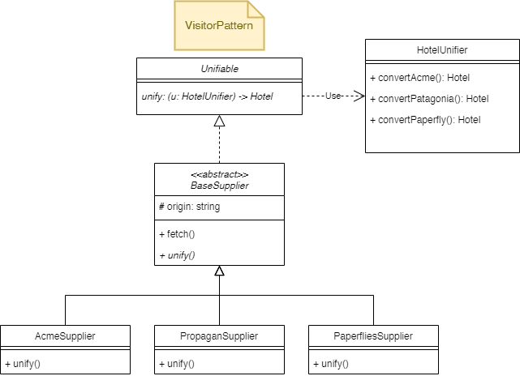

# Ascenda Hotel Merger

To install dependencies:

```bash
bun install
```

To run:

```bash
runner.sh abc,def 123,456
```

> This project was created using `bun init` in bun v1.1.30. [Bun](https://bun.sh) is a fast all-in-one JavaScript runtime.

## Design

The project follows the Visitor Pattern, as the diagram below:



## Main flow of the program

> Main flow of [index.ts](./index.ts)

1. Fetch the hotel data from multiple sources
2. Unify to list of Hotel objects **(this list have duplicated data from sources)**.
3. Merge the list of Hotel objects to get **unique data from sources**.
4. Filter the list of Hotel objects based on the input arguments.
5. Output